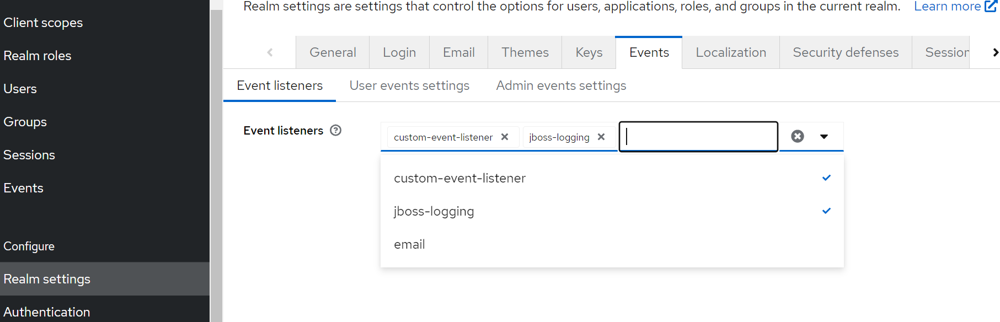
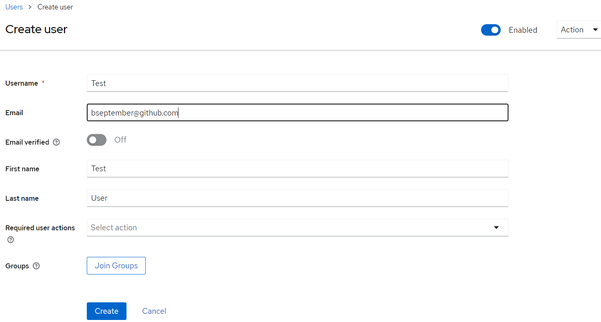
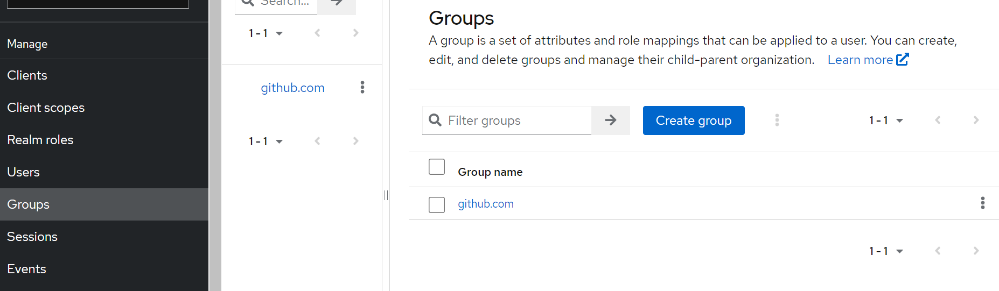
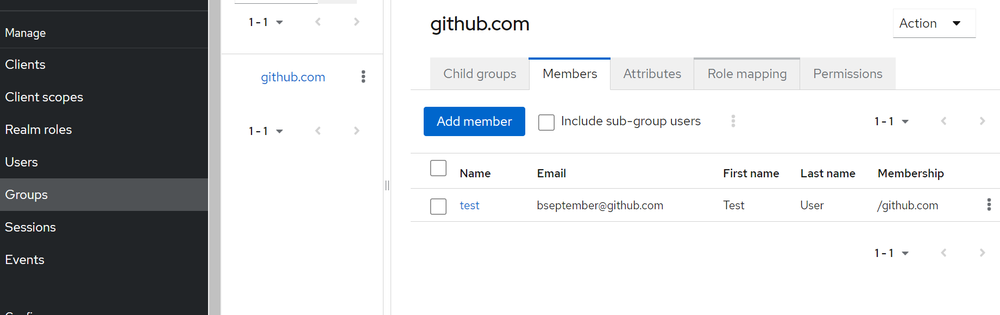

# Keycloak 20.0.5 Extension - Custom Event Listener

"User create" and "register" events, add to group if exists based on email domain


### Clone :
```shell
git clone https://github.com/bseptember/keycloak-custom-event-listener

cd keycloak-custom-event-listener
```

### Generate JAR:
```shell
mvn clean package
```

### Attach keycloak dockerVolume
```yaml
    volumes:
      - /path/to/keycloak-custom-listener/target/custom-event-listener.jar:/opt/keycloak/custom-event-listener.jar
```

### Test :
#### First



#### Then


### Test Result on MockAPI: 
#### Setup Mock API


#### View api result

